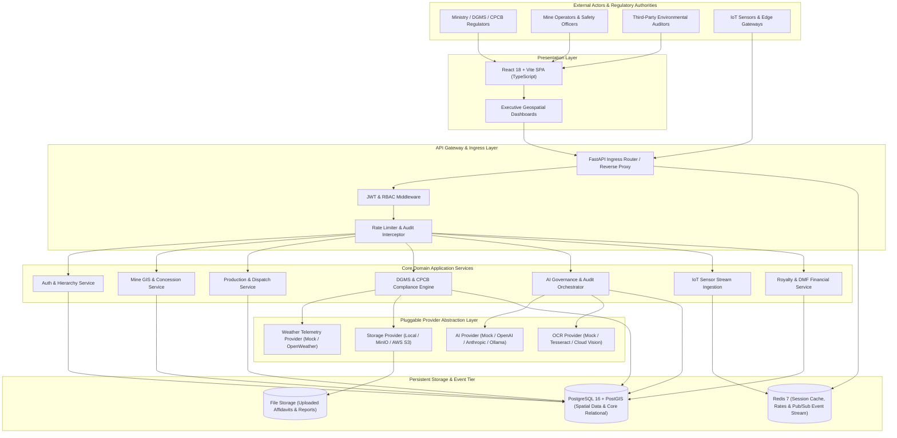
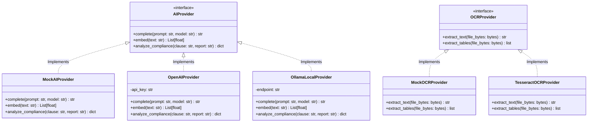
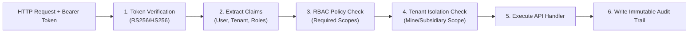
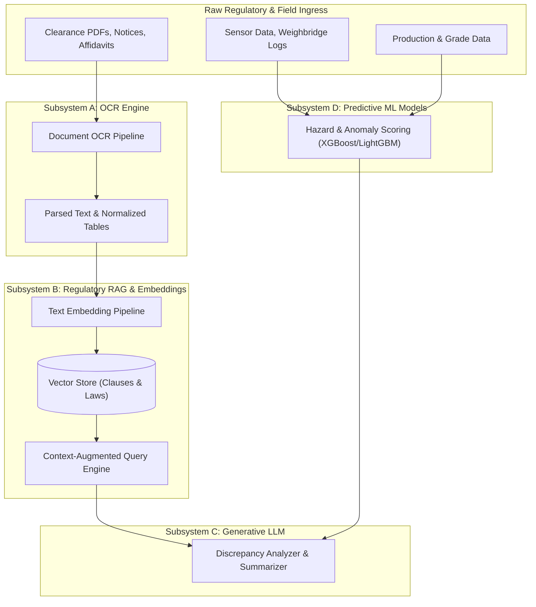

# CoalMine Governance Platform — Architectural Blueprint

> **System Architecture, Engineering Decisions, and Component Blueprints**  
> *Reference Implementation for SIH PSID-26024*

---

## 1. System Overview

The **CoalMine Governance Platform** is a distributed, multi-tenant digital governance and automated compliance surveillance system designed for the coal mining sector. The platform bridges the divide between statutory regulators (Ministry of Coal, DGMS, CPCB/SPCB, State Mining Directorates) and operational entities (Coal India Limited subsidiaries, private commercial miners, captive mine concessionaires).

### Core Capabilities
1. **Hierarchical Multi-Tenancy**: Reflects real-world Indian coal governance (`Ministry` → `Subsidiary` → `Area` → `Colliery/Mine`).
2. **Spatio-Temporal Verification**: Couples PostGIS-backed mine lease boundaries with GPS/RFID weighbridge dispatches to flag illegal mining and boundary breaches.
3. **Pluggable Regulatory Intelligence**: Integrates Optical Character Recognition (OCR) and Retrieval-Augmented Generation (RAG) to cross-check operational returns against statutory clearance stipulations.
4. **Resilient Provider Architecture**: All external dependencies (AI LLMs, Weather telemetry, Document OCR, Cloud Storage) are isolated behind abstract interface contracts with zero-vendor lock-in.

---

## 2. C4 Context & System Architecture

The following diagram illustrates the high-level system context and component interactions across client actors, the API gateway, application domains, pluggable service providers, and persistent storage layers:

---

## 3. Provider Abstraction Rationale & Strategy

To maintain complete vendor independence and allow offline testing without active API keys, all volatile external systems are wrapped in abstract base classes (`Protocol` or `ABC` in Python). Concrete implementations are instantiated dynamically at startup using dependency injection driven by environment variables.

### Key Benefits
- **Zero Local Cost**: Developers and CI pipelines run 100% of test suites with zero external cloud expenses using mock implementations.
- **Resilience**: If a commercial LLM or OCR provider experiences an outage, switching to local models (Ollama, local Tesseract) requires changing only one `.env` flag without touching application code.
- **Air-Gapped Deployment**: Public sector mine operators (e.g., CIL, SCCL) with strict sovereign data requirements can deploy fully on-premise without code modifications.

---

## 4. Data Model Philosophy

Every database model across the platform adheres to four universal architectural rules:

### 1. Universal UUID Primary Keys
All entities utilize version 4 UUIDs (`uuid_generate_v4()` or Python `uuid.uuid4`) as their primary keys instead of sequential auto-incrementing integers.
- **Prevents enumeration attacks**: Internal identifiers cannot be guessed by external actors.
- **Distributed generation**: IDs can be generated on edge nodes, client applications, or microservices before database insertion without key collision.

### 2. Universal Soft Deletes
Physical `DELETE` operations are strictly forbidden on core business records.
- Entities include `is_deleted: bool = False` and `deleted_at: datetime | None = None`.
- Queries default to filtering out `is_deleted == True` via global SQLAlchemy execution hooks or helper query builders.
- Ensures regulatory compliance where records must remain auditable for 10+ years.

### 3. Comprehensive Audit Columns
Every table automatically inherits:
- `created_at: datetime` (UTC timestamp with timezone)
- `updated_at: datetime` (UTC timestamp with timezone, auto-refreshed on updates)
- `created_by_id: UUID | None` (Foreign key to `users.id`)
- `updated_by_id: UUID | None` (Foreign key to `users.id`)

### 4. Multi-Tenant Organizational Hierarchy
Data isolation is strictly maintained through hierarchical organization pointers:
- Level 1: `Ministry` (National regulatory apex)
- Level 2: `Subsidiary` / `Company` (e.g., Eastern Coalfields Limited, BCCL, Adani Mining)
- Level 3: `Area` (Operational administrative group)
- Level 4: `Mine` / `Colliery` (Physical extraction pit/seam)

All operational rows (`production_records`, `dispatches`, `sensor_logs`, `violations`) carry an immutable `mine_id` and inherited `subsidiary_id` to guarantee tenant isolation at both the query layer and database row-level security (RLS).

---

## 5. Module Inventory & Target Phases

The platform is structured into 34 modular functional domains across 11 discrete phases:

| # | Module Name | Internal Identifier | Target Phase | Description |
| :-: | :--- | :--- | :-: | :--- |
| 1 | Core Config & Settings | `core_config` | **Phase 1** | App configurations, Pydantic settings, environment management |
| 2 | Database Engine & Sessions | `database_core` | **Phase 1** | Async SQLAlchemy engine, Asyncpg connection pools, base models |
| 3 | Cache & Redis Store | `cache_redis` | **Phase 1** | Redis client wrapper, connection lifecycle, cache decorators |
| 4 | Provider Base Interfaces | `provider_base` | **Phase 1** | Protocols for AI, OCR, Weather, and Storage providers |
| 5 | Authentication & JWT Engine | `auth_jwt` | **Phase 2** | Password hashing (Argon2/bcrypt), token issuance, refresh flow |
| 6 | Multi-Tenant Org Hierarchy | `org_hierarchy` | **Phase 2** | Models and APIs for Ministry, Subsidiary, Area, and Mine |
| 7 | Role-Based Access Control | `rbac_engine` | **Phase 2** | Dynamic role assignment, granular permission scopes |
| 8 | User Profile Management | `user_profile` | **Phase 2** | User accounts, preferences, notifications, contact directories |
| 9 | Immutable Audit Logging | `audit_log` | **Phase 2** | Structured audit event trail capturing mutations and access |
| 10 | Mine Management & Assets | `mine_management` | **Phase 3** | Coal seams, pit master data, operational status, mine types |
| 11 | Geospatial & PostGIS Mapping | `gis_mapping` | **Phase 3** | Boundary polygons, GeoJSON export, spatial overlap verification |
| 12 | Concession & Lease Covenants | `lease_concessions` | **Phase 3** | Mining lease tenures, statutory boundary buffer zones (500m) |
| 13 | Coal Production Logging | `production_tracking` | **Phase 4** | Daily seam extraction, seam grade (G1-G17), overburden removal |
| 14 | Weighbridge & Dispatch Sync | `weighbridge_dispatch` | **Phase 4** | Automated weight slips, tare/gross differential, gross tonnage |
| 15 | Logistics & e-Way Bill Tracking | `logistics_fleet` | **Phase 4** | RFID tag verification, truck GPS correlation, route adherence |
| 16 | DGMS Safety Shift Monitoring | `safety_compliance` | **Phase 5** | Shift supervisor logs, safety checklist enforcement, PPE logs |
| 17 | Environmental Emissions (CPCB) | `environmental_monitoring`| **Phase 5** | SPM, PM10, PM2.5, Effluent Discharge, Noise level thresholds |
| 18 | Incident & Hazard Reporting | `incident_tracking` | **Phase 5** | Near-miss logs, accident classifications, CAPA tracking |
| 19 | Document OCR Ingestion | `document_ocr` | **Phase 6** | Digitization of MoEFCC clearance letters, DGMS circulars |
| 20 | Regulatory Clause Vector Store | `clause_vectorstore` | **Phase 6** | Embeddings for environmental guidelines and statutory acts |
| 21 | Regulatory Compliance RAG | `compliance_rag` | **Phase 6** | Semantic search & context injection for compliance officers |
| 22 | Automated AI Governance Auditor | `ai_governance_auditor`| **Phase 6** | Discrepancy detector between reported production and leases |
| 23 | IoT Telemetry Ingestion Hub | `iot_telemetry` | **Phase 7** | Ingestion pipeline for edge sensor packets over WebSockets/MQTT |
| 24 | Hazardous Gas Monitoring | `gas_monitoring` | **Phase 7** | Real-time tracking of Methane (CH4), CO, CO2, and O2 levels |
| 25 | Slope Stability Radar Sync | `slope_stability` | **Phase 7** | Open-cast pit wall displacement monitoring and early warnings |
| 26 | Emergency Siren & Alert Dispatch| `alert_dispatch` | **Phase 7** | Automated SMS, webhook, and visual alarm trigger network |
| 27 | Predictive Risk Scoring ML | `risk_ml_models` | **Phase 8** | Multi-factor risk index combining weather, gas, and slope |
| 28 | Predictive Equipment Health | `predictive_maintenance` | **Phase 8** | Heavy Earth Moving Machinery (HEMM) runtime and wear models |
| 29 | Royalty & DMF/NMET Calculation | `royalty_calculation` | **Phase 9** | Ad-valorem royalty formulas, state DMF / NMET levies |
| 30 | Financial Reconciliation Engine | `financial_reconciliation`| **Phase 9** | Production volume vs. royalty payment matching and audit |
| 31 | Executive & Ministry Portals | `dashboards_analytics` | **Phase 10** | High-level interactive KPI views, geospatial risk heatmaps |
| 32 | Statutory PDF Filing Generator | `statutory_reporting` | **Phase 10** | One-click Form I, Form II, and annual return PDF generators |
| 33 | Security Hardening & WAF Rules | `security_hardening` | **Phase 11** | OWASP Top 10 defenses, rate limiting, IP whitelisting |
| 34 | Disaster Recovery & Scale Tuning| `dr_scale_tuning` | **Phase 11** | Read-replicas, partition pruning, automated backup verification |

---

## 6. Technology Decisions Matrix

| Category | Selection | Alternatives Considered | Rationale |
| :--- | :--- | :--- | :--- |
| **Backend Framework** | **FastAPI** | Django, Flask, Express.js | Native asynchronous I/O, auto-generated OpenAPI documentation, Pydantic v2 type safety, high throughput for telemetry. |
| **Database** | **PostgreSQL 16 + PostGIS 3.4** | MySQL, MongoDB, TimescaleDB | PostGIS is the gold standard for geospatial boundary arithmetic (`ST_Contains`, `ST_Intersects`), robust relational integrity. |
| **ORM** | **SQLAlchemy 2.0 (Async)** | Tortoise ORM, Prisma, Peewee | Standard in enterprise Python; full async support with type annotations, Alembic migration compatibility, mature ecosystem. |
| **Cache & Realtime** | **Redis 7 (Alpine)** | Memcached, RabbitMQ | Multi-model capability: acts as high-speed key-value cache, session store, rate limiter, and lightweight pub/sub broker. |
| **Frontend Framework** | **React 18/19 with Vite** | Next.js, Angular, Vue | Fast HMR, minimal overhead for dashboard SPAs, strong typing with TypeScript, rich ecosystem of GIS/mapping widgets (Leaflet/Mapbox). |
| **CSS System** | **Tailwind CSS** | Material UI, Bootstrap, Emotion | Atomic design system, zero-runtime overhead, simple dark-mode and theme customization for high-contrast monitoring rooms. |
| **AI Integration** | **Provider Abstraction Pattern** | Direct OpenAI SDK | Guarantees offline functionality, allows zero-cost local mocking, enables sovereign on-prem LLM deployment. |

---

## 7. Security Architecture

### 1. Authentication & Token Lifecycle
- **Stateless JWT**: Access tokens carry user ID, active organization ID, and role identifiers. Short expiration (8 hours or configurable).
- **Token Blacklisting**: Revoked tokens stored in Redis with TTL matching token expiration.
- **Cryptographic Hashing**: User credentials hashed using Argon2id / bcrypt with individual salting.

### 2. Multi-Level RBAC Hierarchy
Access controls operate on a Matrix of **Roles** and **Tenant Scopes**:
- **System Admin**: Complete platform configuration and tenant provisioning.
- **Ministry Inspector**: Read-only oversight across all subsidiaries, write access to violation orders.
- **Subsidiary Admin**: Full administrative rights within assigned subsidiary and subordinate areas/mines.
- **Mine Manager**: Operational authority for production, dispatch, and safety returns for a specific mine.
- **Safety Officer**: Authority to log DGMS safety checklists, gas readings, and stop-work orders.

### 3. Immutable Audit Trail
Any write operation (`POST`, `PUT`, `PATCH`, `DELETE`) generates an audit log record containing:
- Timestamp (UTC)
- Actor ID and Client IP Address
- HTTP method and Request Endpoint
- Entity Type and Target Record UUID
- Pre-mutation state vs. Post-mutation state (JSON diff)

---

## 8. AI Architecture & Workload Separation

To prevent cross-contamination and resource exhaustion, AI capabilities are categorized into four specialized subsystems:

1. **OCR Subsystem**: Focuses purely on image-to-text and table extraction from statutory PDF documents (EC letters, DGMS circulars). Operates asynchronously via background tasks.
2. **Regulatory Vector Store & RAG Subsystem**: Pre-indexes statutory acts (Mines Act 1952, Coal Mines Regulations 2017, Forest Conservation Act). Retrieves relevant sections during audit checks to ground LLM reasoning in verified Indian law.
3. **Generative LLM Subsystem**: Performs qualitative synthesis, natural language compliance summaries, and drafting of discrepancy notices.
4. **Predictive ML Subsystem**: Strictly numerical machine learning models (gradient boosting, time-series forecasting) that evaluate slope stability sensor trends, gas anomaly spikes, and production over-reporting without non-deterministic hallucinations.
